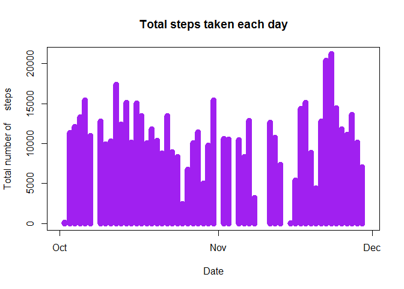
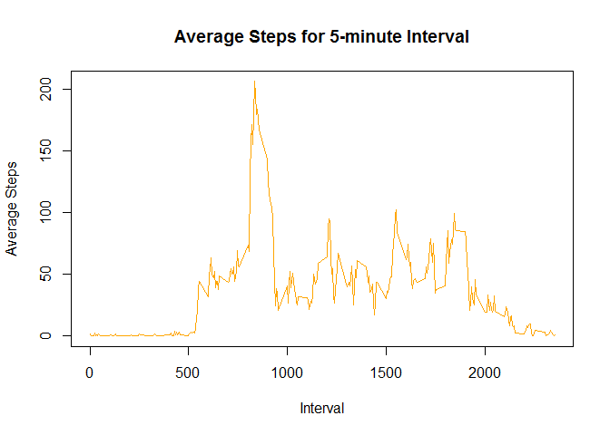
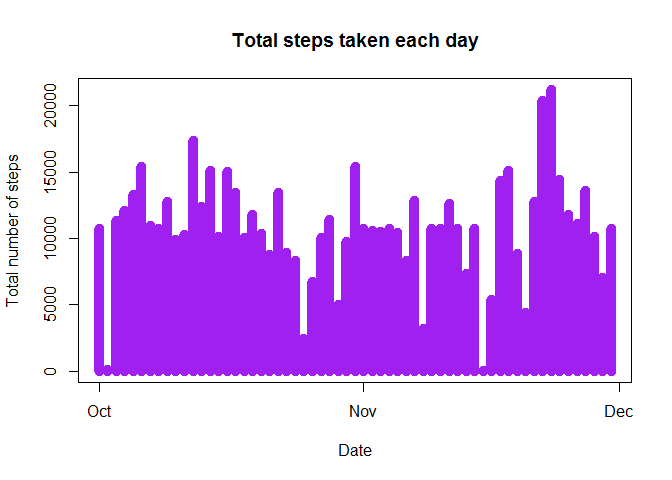
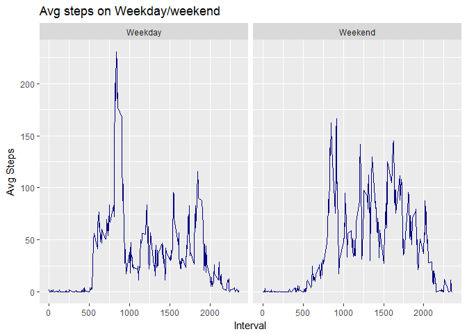

# Reproducible Research: Peer Assessment 1


## Loading and preprocessing the data

 
   

```r
 temp <- tempfile()
    download.file("https://d396qusza40orc.cloudfront.net/repdata%2Fdata%2Factivity.zip", temp, mode="wb")
    unzip(temp, "activity.csv")
    activity_data <- read.table("activity.csv", sep=",", header=T)
```


## What is mean total number of steps taken per day?

   
    
### Histogram of the total number of steps taken each day


```r
 agg_data<-aggregate(activity_data$steps, list(activity_data$date),sum)
    names(agg_data)<- c("date","total_steps")
    agg_data$date<-as.POSIXct(agg_data$date)
    plot(agg_data$date,agg_data$total_steps,type = 'h', lwd=10,col="purple",xlab='Date', ylab='Total number of     steps', main = 'Total steps taken each day')
```

<!-- -->

   
   
##R code to calculate the mean and median of total no. of steps taken each day

    
   

```r
  mean_data<-aggregate(activity_data$steps,list(activity_data$date),mean)
    names(mean_data)<- c("date","mean_value")
    mean_data
```

```
##          date mean_value
## 1  2012-10-01         NA
## 2  2012-10-02  0.4375000
## 3  2012-10-03 39.4166667
## 4  2012-10-04 42.0694444
## 5  2012-10-05 46.1597222
## 6  2012-10-06 53.5416667
## 7  2012-10-07 38.2465278
## 8  2012-10-08         NA
## 9  2012-10-09 44.4826389
## 10 2012-10-10 34.3750000
## 11 2012-10-11 35.7777778
## 12 2012-10-12 60.3541667
## 13 2012-10-13 43.1458333
## 14 2012-10-14 52.4236111
## 15 2012-10-15 35.2048611
## 16 2012-10-16 52.3750000
## 17 2012-10-17 46.7083333
## 18 2012-10-18 34.9166667
## 19 2012-10-19 41.0729167
## 20 2012-10-20 36.0937500
## 21 2012-10-21 30.6284722
## 22 2012-10-22 46.7361111
## 23 2012-10-23 30.9652778
## 24 2012-10-24 29.0104167
## 25 2012-10-25  8.6527778
## 26 2012-10-26 23.5347222
## 27 2012-10-27 35.1354167
## 28 2012-10-28 39.7847222
## 29 2012-10-29 17.4236111
## 30 2012-10-30 34.0937500
## 31 2012-10-31 53.5208333
## 32 2012-11-01         NA
## 33 2012-11-02 36.8055556
## 34 2012-11-03 36.7048611
## 35 2012-11-04         NA
## 36 2012-11-05 36.2465278
## 37 2012-11-06 28.9375000
## 38 2012-11-07 44.7326389
## 39 2012-11-08 11.1770833
## 40 2012-11-09         NA
## 41 2012-11-10         NA
## 42 2012-11-11 43.7777778
## 43 2012-11-12 37.3784722
## 44 2012-11-13 25.4722222
## 45 2012-11-14         NA
## 46 2012-11-15  0.1423611
## 47 2012-11-16 18.8923611
## 48 2012-11-17 49.7881944
## 49 2012-11-18 52.4652778
## 50 2012-11-19 30.6979167
## 51 2012-11-20 15.5277778
## 52 2012-11-21 44.3993056
## 53 2012-11-22 70.9270833
## 54 2012-11-23 73.5902778
## 55 2012-11-24 50.2708333
## 56 2012-11-25 41.0902778
## 57 2012-11-26 38.7569444
## 58 2012-11-27 47.3819444
## 59 2012-11-28 35.3576389
## 60 2012-11-29 24.4687500
## 61 2012-11-30         NA
```

```r
    total_mean<-mean(agg_data$total_steps,na.rm = TRUE)
    total_mean
```

```
## [1] 10766.19
```

```r
    total_median<- median(agg_data$total_steps,na.rm = TRUE)
    total_median
```

```
## [1] 10765
```


## What is the average daily activity pattern?

##R code to plot a time series for 5-minute interval
  

```r
      activity_data_not_na<-activity_data[!(is.na(activity_data$steps)),]
      interval_data<-aggregate(activity_data_not_na$steps,list(activity_data_not_na$interval),mean)
      names(interval_data)<-c("interval","avg_steps")
      plot(interval_data$interval,interval_data$avg_steps,type = 'l',xlab =  "Interval",ylab = "Average Steps",       main = "Average Steps for 5-minute Interval", col="orange")
```

<!-- -->

```r
      max_interval<-interval_data[which.max(interval_data$avg_steps),]
      max_interval
```

```
##     interval avg_steps
## 104      835  206.1698
```
  
## Imputing missing values

```r
    total_missing_rows<-sum(is.na(activity_data))
    total_missing_rows
```

```
## [1] 2304
```

```r
    activity_data2<-activity_data
    missing_data<-is.na(activity_data2$steps)
    mean_value<-tapply(activity_data_not_na$steps,activity_data_not_na$interval,mean,na.rm=TRUE,simplify = TRUE)
    activity_data2$steps[missing_data]<-mean_value[as.character(activity_data2$interval[missing_data])]
    sum(is.na(activity_data2))
```

```
## [1] 0
```
##R code to plot histogram on new dataset

```r
    agg_data2<-aggregate(activity_data2$steps, list(activity_data2$date),sum)
    names(agg_data2)<- c("date","total_steps")
    agg_data2$date<-as.POSIXct(agg_data2$date)
    plot(agg_data2$date,agg_data2$total_steps,type = 'h', lwd=10,col="purple",xlab='Date', ylab='Total number of steps', main = 'Total steps taken each day')
```

<!-- -->
##R code to calculate the mean and median of total no. of steps taken each day on new dataset

```r
    mean_data2<-aggregate(activity_data2$steps,list(activity_data2$date),mean)
    names(mean_data2)<- c("date","mean_value")
    mean_data2
```

```
##          date mean_value
## 1  2012-10-01 37.3825996
## 2  2012-10-02  0.4375000
## 3  2012-10-03 39.4166667
## 4  2012-10-04 42.0694444
## 5  2012-10-05 46.1597222
## 6  2012-10-06 53.5416667
## 7  2012-10-07 38.2465278
## 8  2012-10-08 37.3825996
## 9  2012-10-09 44.4826389
## 10 2012-10-10 34.3750000
## 11 2012-10-11 35.7777778
## 12 2012-10-12 60.3541667
## 13 2012-10-13 43.1458333
## 14 2012-10-14 52.4236111
## 15 2012-10-15 35.2048611
## 16 2012-10-16 52.3750000
## 17 2012-10-17 46.7083333
## 18 2012-10-18 34.9166667
## 19 2012-10-19 41.0729167
## 20 2012-10-20 36.0937500
## 21 2012-10-21 30.6284722
## 22 2012-10-22 46.7361111
## 23 2012-10-23 30.9652778
## 24 2012-10-24 29.0104167
## 25 2012-10-25  8.6527778
## 26 2012-10-26 23.5347222
## 27 2012-10-27 35.1354167
## 28 2012-10-28 39.7847222
## 29 2012-10-29 17.4236111
## 30 2012-10-30 34.0937500
## 31 2012-10-31 53.5208333
## 32 2012-11-01 37.3825996
## 33 2012-11-02 36.8055556
## 34 2012-11-03 36.7048611
## 35 2012-11-04 37.3825996
## 36 2012-11-05 36.2465278
## 37 2012-11-06 28.9375000
## 38 2012-11-07 44.7326389
## 39 2012-11-08 11.1770833
## 40 2012-11-09 37.3825996
## 41 2012-11-10 37.3825996
## 42 2012-11-11 43.7777778
## 43 2012-11-12 37.3784722
## 44 2012-11-13 25.4722222
## 45 2012-11-14 37.3825996
## 46 2012-11-15  0.1423611
## 47 2012-11-16 18.8923611
## 48 2012-11-17 49.7881944
## 49 2012-11-18 52.4652778
## 50 2012-11-19 30.6979167
## 51 2012-11-20 15.5277778
## 52 2012-11-21 44.3993056
## 53 2012-11-22 70.9270833
## 54 2012-11-23 73.5902778
## 55 2012-11-24 50.2708333
## 56 2012-11-25 41.0902778
## 57 2012-11-26 38.7569444
## 58 2012-11-27 47.3819444
## 59 2012-11-28 35.3576389
## 60 2012-11-29 24.4687500
## 61 2012-11-30 37.3825996
```

```r
    total_mean2<-mean(agg_data2$total_steps,na.rm = TRUE)
    total_mean2
```

```
## [1] 10766.19
```

```r
    total_median2<- median(agg_data2$total_steps,na.rm = TRUE)
    total_median2
```

```
## [1] 10766.19
```
##The new and old mean remains same but the new median incresed by 1.19

```r
    paste("Old Mean: ", total_mean )
```

```
## [1] "Old Mean:  10766.1886792453"
```

```r
    paste("New Mean: ", total_mean2)
```

```
## [1] "New Mean:  10766.1886792453"
```

```r
    paste("Old Median: ", total_median)
```

```
## [1] "Old Median:  10765"
```

```r
    paste("New Median: ", total_median2)
```

```
## [1] "New Median:  10766.1886792453"
```
##R code to add a new variable for weekday

```r
    library(ggplot2)
    activity_data2$date<-as.POSIXct(activity_data2$date)
    activity_data2$day <- weekdays(activity_data2$date)
    activity_data2$day_type<-ifelse(activity_data2$day == 'Sunday' | activity_data2$day =='Saturday', 'Weekend','Weekday')
    activity_data2$day_type<-as.factor(activity_data2$day_type)
    interval_data2<-aggregate(activity_data2$steps,list(activity_data2$interval,activity_data2$day_type),mean)
    names(interval_data2)<-c("interval","day_type","avg_steps")
    ggplot(interval_data2,aes(interval,avg_steps))+geom_line(col="navy blue")+facet_grid(.~day_type)+labs(x="Interval",y="Avg Steps",title="Avg steps on Weekday/weekend")
```

<!-- -->
